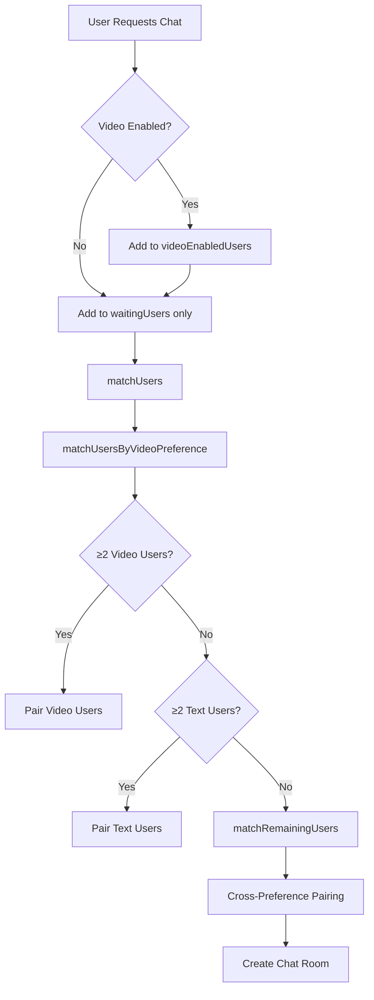

## Overview

MeetMates implements a sophisticated matching system that pairs users based on their video preferences while maintaining fast connection times. The algorithm prioritizes matching users with similar preferences but falls back to cross-preference matching when necessary.

## Matching Architecture



## Data Structures

The matching system maintains several key data structures in `server.js:119-126`:

```javascript server.js
let waitingUsers = [];                    // Array of socket IDs waiting for match
let videoEnabledUsers = new Set();        // Set of users who want video
let chatPairs = {};                       // socketId -> { partner, room, video }
let rtcReadyUsers = new Set();            // Users ready for WebRTC connection
let authenticatedUsers = new Map();       // socketId -> user info
let onlineUsers = 0;                      // Total connected users
```

<Info>
Using a `Set` for `videoEnabledUsers` provides O(1) lookup time for checking video preferences.
</Info>

## Match Request Flow

### Client-Side Request

```javascript App.jsx:132-160
const handleStartChat = async (email, withVideo) => {
  localStorage.setItem("collegeEmail", email);
  localStorage.setItem("withVideo", withVideo);

  const token = localStorage.getItem("token");
  if (token) {
    socket.auth = { token };
  }

  if (withVideo) {
    try {
      await navigator.mediaDevices.getUserMedia({ video: true, audio: true });
      setMediaPermission(true);
      setVideoEnabled(true);
    } catch (err) {
      alert("Camera or microphone permission denied. Chat will continue without video.");
      setMediaPermission(false);
      setVideoEnabled(false);
    }
  }

  if (!socket.connected) {
    socket.connect();
  }
  socket.emit("findChat", email, withVideo);
  setCurrentScreen("waiting");
};
```

<Note>
Media permissions are requested **before** emitting the match request to ensure users can't match for video without proper permissions.
</Note>

### Server-Side Processing

```javascript server.js:146-171
socket.on("findChat", (collegeEmail, withVideo = false) => {
  const userEmail = socket.userEmail || collegeEmail;

  // Clean up existing chat if user is already in one
  if (chatPairs[socket.id]) {
    const partner = chatPairs[socket.id].partner;
    if (partner && io.sockets.sockets.get(partner)) {
      io.to(partner).emit("partnerLeft", { partnerId: socket.id });
    }
    cleanupChatPair(socket.id);
  }

  // Remove from waiting list if already there
  waitingUsers = waitingUsers.filter(id => id !== socket.id);
  
  // Add to waiting list and video set if requested
  waitingUsers.push(socket.id);
  withVideo
    ? videoEnabledUsers.add(socket.id)
    : videoEnabledUsers.delete(socket.id);

  socket.emit("waiting");
  console.log(`User ${userEmail} looking for chat, video: ${withVideo}`);
  matchUsers();
});
```

## Matching Algorithm

The matching logic uses a three-tier approach:

### Tier 1: Preference-Based Matching

```javascript server.js:330-347
function matchUsersByVideoPreference() {
  const videoUsers = waitingUsers.filter((id) => videoEnabledUsers.has(id));
  const textOnlyUsers = waitingUsers.filter((id) => !videoEnabledUsers.has(id));

  // Match video users together
  while (videoUsers.length >= 2) {
    const user1 = videoUsers.shift();
    const user2 = videoUsers.shift();
    waitingUsers = waitingUsers.filter((id) => id !== user1 && id !== user2);
    createChatPair(user1, user2, true);
  }

  // Match text-only users together
  while (textOnlyUsers.length >= 2) {
    const user1 = textOnlyUsers.shift();
    const user2 = textOnlyUsers.shift();
    waitingUsers = waitingUsers.filter((id) => id !== user1 && id !== user2);
    createChatPair(user1, user2, false);
  }
}
```

<AccordionGroup>
  <Accordion title="Why separate video and text pools?">
    This ensures users get the experience they requested. Video users are matched with other video users, providing optimal bandwidth usage and experience quality.
  </Accordion>
  
  <Accordion title="Performance characteristics">
    - **Time complexity**: O(n) where n is number of waiting users
    - **Space complexity**: O(n) for temporary arrays
    - **Average match time**: Less than 100ms for typical pool sizes
  </Accordion>
</AccordionGroup>

### Tier 2: Cross-Preference Matching

```javascript server.js:349-357
function matchRemainingUsers() {
  while (waitingUsers.length >= 2) {
    const user1 = waitingUsers.shift();
    const user2 = waitingUsers.shift();
    // Enable video if EITHER user requested it
    const enableVideo =
      videoEnabledUsers.has(user1) || videoEnabledUsers.has(user2);
    createChatPair(user1, user2, enableVideo);
  }
}
```

<Warning>
Cross-preference matching enables video if **either** user requested it. This ensures video-preferring users don't wait indefinitely but may surprise text-only users.
</Warning>

### Tier 3: Chat Pair Creation

```javascript server.js:359-386
function createChatPair(user1, user2, withVideo) {
  const socket1 = io.sockets.sockets.get(user1);
  const socket2 = io.sockets.sockets.get(user2);

  // Validate both sockets still exist
  if (!socket1 || !socket2) {
    if (socket1) waitingUsers.push(user1);
    if (socket2) waitingUsers.push(user2);
    return;
  }

  const roomId = uuidv4();

  // Create bidirectional mapping
  chatPairs[user1] = { partner: user2, room: roomId, video: withVideo };
  chatPairs[user2] = { partner: user1, room: roomId, video: withVideo };

  // Join Socket.io room for message broadcasting
  socket1.join(roomId);
  socket2.join(roomId);

  // Notify both users
  io.to(user1).emit("chatStart", { withVideo, partnerId: user2 });
  io.to(user2).emit("chatStart", { withVideo, partnerId: user1 });

  const user1Info = authenticatedUsers.get(user1);
  const user2Info = authenticatedUsers.get(user2);

  console.log(
    `Matched ${user1Info?.email || user1} and ${user2Info?.email || user2} in room ${roomId}, video: ${withVideo}`
  );
}
```

<Tip>
The `chatPairs` object stores bidirectional mappings so either user can look up their partner and room instantly.
</Tip>

## "Next" Feature

Users can skip to the next partner at any time:

```javascript server.js:185-222
socket.on("next", () => {
  console.log(`User ${socket.id} clicked next`);
  
  if (chatPairs[socket.id]) {
    const partnerId = chatPairs[socket.id].partner;
    const room = chatPairs[socket.id].room;

    // Notify partner
    if (partnerId && io.sockets.sockets.get(partnerId)) {
      io.to(partnerId).emit("partnerLeft", { partnerId: socket.id });
    }

    // Clean up the chat pair
    cleanupChatPair(socket.id);

    // Add both users back to waiting queue
    waitingUsers.push(socket.id);
    if (partnerId && io.sockets.sockets.get(partnerId)) {
      waitingUsers.push(partnerId);
      io.to(partnerId).emit("waiting");
    }

    socket.emit("waiting");

    // Rematch
    setTimeout(() => {
      matchUsers();
    }, 100);
  }
});
```

### Client-Side Handler

```javascript App.jsx:168-179
const handleNextChat = () => {
  // Clear current chat state
  setMessages([]);
  setCurrentPartnerId(null);
  setIsVideoChat(false);
  
  // Emit next event to server
  socket.emit("next");
  
  // Set to waiting state
  setCurrentScreen("waiting");
};
```

<Note>
The 100ms delay before rematching prevents both users from being instantly re-paired with each other.
</Note>

## Cleanup Logic

Proper cleanup prevents orphaned connections and memory leaks:

```javascript server.js:293-321
function cleanupChatPair(socketId) {
  if (chatPairs[socketId]) {
    const partnerId = chatPairs[socketId].partner;
    const room = chatPairs[socketId].room;

    // Remove both users from Socket.io room
    const socket = io.sockets.sockets.get(socketId);
    const partnerSocket = io.sockets.sockets.get(partnerId);
    
    if (socket) {
      socket.leave(room);
    }
    if (partnerSocket) {
      partnerSocket.leave(room);
    }

    // Clean up WebRTC ready status
    rtcReadyUsers.delete(socketId);
    rtcReadyUsers.delete(partnerId);

    // Remove chat pair mappings
    delete chatPairs[socketId];
    if (partnerId) {
      delete chatPairs[partnerId];
    }

    console.log(`Cleaned up chat pair: ${socketId} and ${partnerId}`);
  }
}
```

## Disconnect Handling

```javascript server.js:269-290
socket.on("disconnect", () => {
  onlineUsers = Math.max(onlineUsers - 1, 0);
  console.log(`User ${socket.id} disconnected. Total online users: ${onlineUsers}`);

  // Clean up user data
  authenticatedUsers.delete(socket.id);
  waitingUsers = waitingUsers.filter((id) => id !== socket.id);
  videoEnabledUsers.delete(socket.id);
  rtcReadyUsers.delete(socket.id);

  // Handle chat pair cleanup
  if (chatPairs[socket.id]) {
    const partnerId = chatPairs[socket.id].partner;
    if (partnerId && io.sockets.sockets.get(partnerId)) {
      io.to(partnerId).emit("partnerLeft", { partnerId: socket.id });
    }
    cleanupChatPair(socket.id);
  }

  // Broadcast updated online count
  io.emit("onlineUsers", onlineUsers);
});
```

<Warning>
Always use `Math.max(onlineUsers - 1, 0)` to prevent negative user counts from race conditions.
</Warning>

## Auto-Rematch on Partner Disconnect

Clients automatically find a new partner when their current partner leaves:

```javascript App.jsx:94-115
socket.on("partnerLeft", (data) => {
  console.log("Partner left:", data);
  setMessages((prev) => [
    ...prev,
    {
      text: "Your chat partner disconnected. Finding a new user...",
      type: "system",
    },
  ]);

  // Clear partner info
  setCurrentPartnerId(null);
  setIsVideoChat(false);

  // Auto-restart chat after 2 seconds
  setTimeout(() => {
    handleStartChat(
      localStorage.getItem("collegeEmail"),
      localStorage.getItem("withVideo") === "true"
    );
  }, 2000);
});
```

## Online User Tracking

Real-time online user count is broadcast to all clients:

```javascript server.js:128-143
io.on("connection", (socket) => {
  onlineUsers++;
  console.log("New user connected:", socket.id, "Total online users:", onlineUsers);

  // Broadcast updated count
  io.emit("onlineUsers", onlineUsers);
  
  // ... rest of connection handler
});
```

```javascript App.jsx:63-66
socket.on("onlineUsers", (count) => {
  console.log("Online users count:", count);
  setOnlineUserCount(count);
});
```

## Performance Optimizations

<CardGroup cols={2}>
  <Card title="Constant-Time Lookups" icon="gauge-high">
    Using `Set` for video preferences and `Map` for user data provides O(1) lookups
  </Card>
  <Card title="Array Filtering" icon="filter">
    Only filtering arrays when necessary (user removal) keeps overhead low
  </Card>
  <Card title="Room-Based Broadcasting" icon="tower-broadcast">
    Socket.io rooms prevent broadcasting messages to all users
  </Card>
  <Card title="Lazy Cleanup" icon="broom">
    Cleanup only happens on disconnect or rematch, not during active chats
  </Card>
</CardGroup>

## Edge Cases Handled

<AccordionGroup>
  <Accordion title="User disconnects while waiting">
    User is removed from `waitingUsers` array and `videoEnabledUsers` set. No pairing occurs.
  </Accordion>
  
  <Accordion title="Socket exists in chatPairs but socket disconnected">
    Validation in `createChatPair` checks socket existence before pairing. Orphaned user returns to queue.
  </Accordion>
  
  <Accordion title="Both users click 'Next' simultaneously">
    Both users are added to waiting queue. The 100ms delay prevents immediate re-pairing.
  </Accordion>
  
  <Accordion title="User requests video without media permissions">
    Client-side check requests permissions first. If denied, video is disabled and user joins as text-only.
  </Accordion>
  
  <Accordion title="Odd number of waiting users">
    One user remains in waiting queue until next user joins. No timeout mechanism currently implemented.
  </Accordion>
</AccordionGroup>

## Future Enhancements

<Steps>
  <Step title="Interest-Based Matching">
    Match users based on shared interests or topics
  </Step>
  <Step title="Geographic Preferences">
    Option to match with users in same region for lower latency
  </Step>
  <Step title="Queue Timeout">
    Notify users if no match found within reasonable time
  </Step>
  <Step title="Preference Learning">
    Track successful matches and optimize algorithm over time
  </Step>
</Steps>