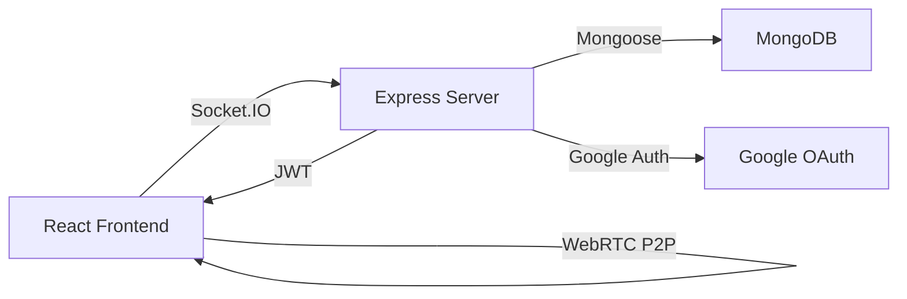

## What is MeetMates?

MeetMates (also known as Pingo) is a college-exclusive platform that enables students to connect via random video calls in a safe and verified environment. By using college email IDs for authentication, the platform ensures that only verified students can join, fostering meaningful connections within the campus community.

## Key Features

<CardGroup cols={2}>
  <Card title="College Email Authentication" icon="shield-check">
    Ensures only students from the college can join using Google OAuth restricted to college email domains
  </Card>
  <Card title="Random Video Matching" icon="video">
    Connects users with random peers for seamless conversations and new connections
  </Card>
  <Card title="Real-Time WebRTC" icon="signal-stream">
    Powered by WebRTC for smooth peer-to-peer video communication with low latency
  </Card>
  <Card title="Secure & Private" icon="lock">
    JWT-based authentication prevents unauthorized access and ensures data privacy
  </Card>
  <Card title="Minimal UI" icon="sparkles">
    A simple, distraction-free interface built with React for easy interaction
  </Card>
  <Card title="Safety Features" icon="user-shield">
    Includes reporting and blocking features to maintain a positive experience
  </Card>
</CardGroup>

## How It Works

<Steps>
  <Step title="Authentication">
    Users sign in using Google OAuth restricted to college email domains. Their token is validated on the backend via `/api/verify-token` before connecting to the Socket.IO server.
  </Step>
  
  <Step title="Matching">
    Users can opt for video or audio-only chat. When they click "Start Chat", a `findChat` event is emitted. The server pairs them with another waiting user based on preferences.
  </Step>
  
  <Step title="WebRTC Connection">
    If video is enabled, MeetMates establishes a WebRTC peer-to-peer connection between users for low-latency video communication. Text-only messaging is available for audio-only chats.
  </Step>
  
  <Step title="Chat Session">
    Once connected, users can chat freely. Messages are relayed via Socket.IO events, and the UI handles rendering local/remote streams and chat history.
  </Step>
  
  <Step title="Next/Leave">
    Users can click "Next" or leave the session to disconnect from the current room. The app resets state and automatically searches for a new partner.
  </Step>
</Steps>

## Tech Stack

<CardGroup cols={2}>
  <Card title="Frontend" icon="react">
    - **Framework**: React 19 with Vite
    - **Styling**: TailwindCSS 4.0
    - **Real-time**: Socket.IO Client 4.8
    - **UI Icons**: Lucide React
  </Card>
  
  <Card title="Backend" icon="server">
    - **Runtime**: Node.js with Express 4.21
    - **Database**: MongoDB with Mongoose 8.13
    - **Authentication**: Google OAuth + JWT
    - **Real-time**: Socket.IO 4.8 + WebRTC
  </Card>
</CardGroup>

## Use Cases

<AccordionGroup>
  <Accordion title="Breaking the Ice">
    Help new students connect with their peers and make friends on campus through casual video conversations.
  </Accordion>
  
  <Accordion title="Study Partners">
    Find fellow students to discuss coursework, form study groups, or collaborate on projects.
  </Accordion>
  
  <Accordion title="Campus Community">
    Build a stronger campus community by connecting students across different departments and year levels.
  </Accordion>
  
  <Accordion title="Language Practice">
    Practice communication skills and language exchange with other students in a safe environment.
  </Accordion>
</AccordionGroup>

## Architecture Overview

MeetMates uses a modern full-stack architecture:

<Note>
  MeetMates prioritizes user safety with college-verified authentication, ensuring all participants are legitimate students from your institution.
</Note>

## Next Steps

<CardGroup cols={2}>
  <Card title="Quickstart" icon="rocket" href="/quickstart">
    Get MeetMates running locally in under 5 minutes
  </Card>
  <Card title="Installation" icon="download" href="/installation">
    Detailed setup instructions for frontend and backend
  </Card>
</CardGroup>
